# Flutter: Imprima em sua impressora térmica via Bluetooth (com caracteres especiais)

Desenvolvi este projeto em Flutter com o intuito de realizar uma prova de conceito ao criar um APP que se conecte a uma impressora térmica e imprima textos com caracteres especiais.

> Artigo original publicado no Medium em 25 de outubro de 2021: [Flutter: Imprima em sua impressora térmica via bluetooth (com caracteres especiais)](https://paulobtx.medium.com/flutter-imprima-em-sua-impressora-t%C3%A9rmica-via-bluetooth-com-caracteres-especiais-8570a484c036)


*Photo by Florian Olivo on Unsplash*

## Histórico

Um dia desses um cliente me procurou para fazer um APP na qual fosse possível preencher alguns campos e mandar para uma impressora térmica. Apesar de já ter pensado em fazer isso em outras oportunidades, de fato, nunca havia feito.

Meu cliente teve a oportunidade de conseguir uma dessas impressoras chinesas e um celular Android Redmi Note 9 para esse projeto.

Aqui vou descrever minha experiência, os problemas que encontrei e as soluções adotadas.

## Requisitos iniciais

- Uma impressora térmica que aceita conexão via bluetooth, com uma quantidade de bobina de papel considerável para os testes;

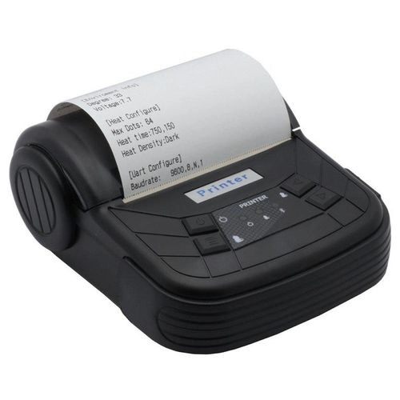

- Um celular Android (a conexão bluetooth não funciona via emulador) com o modo de depuração e desenvolvimento habilitado;
- O único framework que utilizo neste tutorial é o Flutter (linguagem Dart) em sua versão 2.5.3;
- Um editor de código preferido. Eu utilizo o VS Code;
- O pacote de ADB para o Android instalado. Você pode ler mais sobre isso aqui: https://developer.android.com/studio/command-line/adb?hl=pt-br

## Packages utilizados

**Blue Thermal Printer** na versão 1.1.8

- GitHub: https://github.com/kakzaki/blue_thermal_printer
- Pub.dev: https://pub.dev/packages/blue_thermal_printer/

**Permission Handler**

- GitHub: https://github.com/Baseflow/flutter-permission-handler
- Pub.dev: https://pub.dev/packages/permission_handler/

## Criação do projeto

Particularmente gosto de criar os projetos utilizando a linha de comando. Outros preferem pelo Visual Studio Code ou pelo Android Studio.

Abra o prompt de comando do Windows e, na pasta em que deseja que o projeto seja criado, digite:

```bash
flutter create -t skeleton thermalprinter
```

Nesse comando, o `-t skeleton` é o template escolhido e o `thermalprinter` é o nome do projeto que estou criando.


O resultado deve ser algo próximo disso:

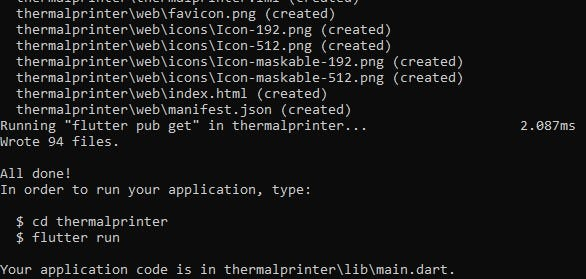

Abra a pasta no seu editor preferido. Eu utilizarei o VS Code.

## 1ª etapa — Criando o projeto

Ao criar um projeto novo, usando esse template, nessa versão do Flutter, há alguns ajustes iniciais que precisamos fazer para que ele fique compilável.

Inicialmente esses problemas irão aparecer. O motivo é simples: precisamos baixar os pacotes iniciais.


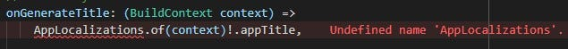

Se você estiver usando o VS Code, na aba de terminal, dentro do diretório do projeto, você pode executar o comando:

```bash
flutter pub get
```

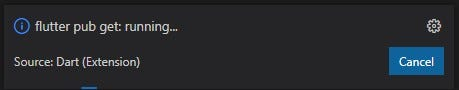

Caso não tenha conseguido achar a aba de terminal, você pode clicar em **View** e selecioná-lo.

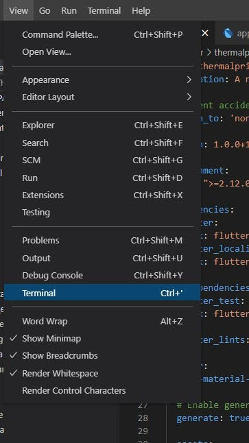

## 2ª etapa — Configurar o celular

O bluetooth não funciona por emulador, então é necessário que o debug seja feito diretamente em um celular Android.

Procure como habilitar a depuração e o modo de desenvolvedor no seu celular especificamente. Por existirem muitas formas diferentes de chegar ao mesmo caminho, dependendo da versão e do modelo, não tem como eu contemplar essa informação aqui.

Vamos adicionar um arquivo no projeto para que o VS Code reconheça o seu celular como opção.

Antes precisamos descobrir o device ID do seu aparelho. Abra o prompt de comando do Windows, vá na pasta do ADB que você já deve ter baixado (veja os requisitos) e digite:

```bash
adb devices
```

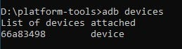

Se o celular estiver conectado pelo cabo USB e já tiver as permissões necessárias, deve aparecer o seu ID.

Voltando ao projeto, se não houver a pasta `.vscode`, crie. Dentro dela crie um arquivo com o nome `launch.json` e coloque o código de configuração (troque o `deviceId` pelo seu):

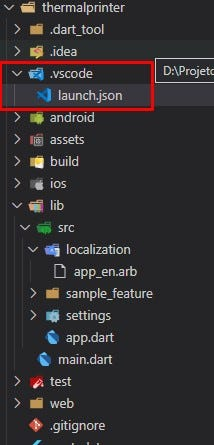

Esse código será necessário para que o VS Code saiba para onde direcionar o "debug" posteriormente.

## 3ª etapa — Achando um pacote que funcione

Essa foi a parte mais complicada: conectar com a impressora e imprimir caracteres especiais.

O cliente chegou com uma impressora que havia conseguido e, portanto, não tivemos escolha. Há outras impressoras que se conectam diretamente via bluetooth do celular, mas essa não. Ao abrir, no celular, os dispositivos bluetooth encontrados, aparecia a impressora, mas quando mandava parear, não conectava.

Descobri que nem todas as impressoras pareiam diretamente com o celular. Sendo assim, fui desbravar os pacotes que encontrei no pub.dev.

Para adiantar nosso aprendizado, o único pacote que consegui ter sucesso foi o `blue_thermal_printer`.

No arquivo `pubspec.yaml`, que fica na raiz do projeto, adicione o pacote conforme a imagem. Não esqueça de dar o `flutter pub get` para baixar.

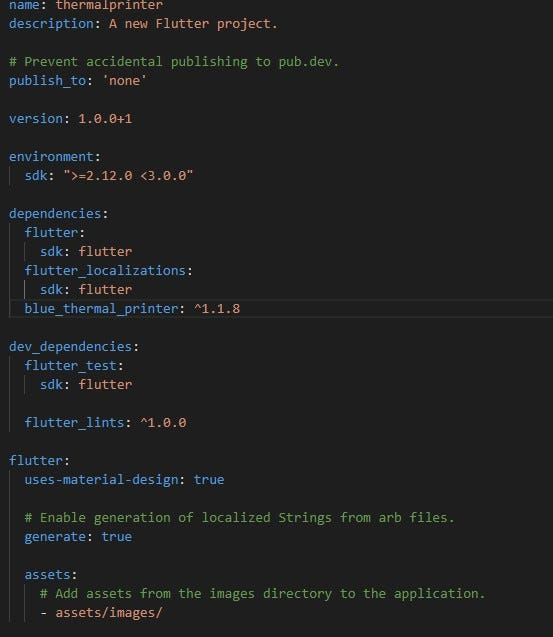

Na versão que eu testei, ele estava com um problema por não ter a versão Flutter Web e, sendo assim, precisamos fazer uma nova adaptação.

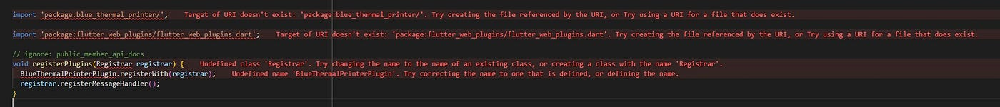

Para resolver, crie um arquivo no diretório raiz do projeto com o nome `analysis_options.yaml` (isso se não existir) e adicione o seguinte código:

```yaml
analyzer:
  exclude: [lib/generated_plugin_registrant.dart]
```

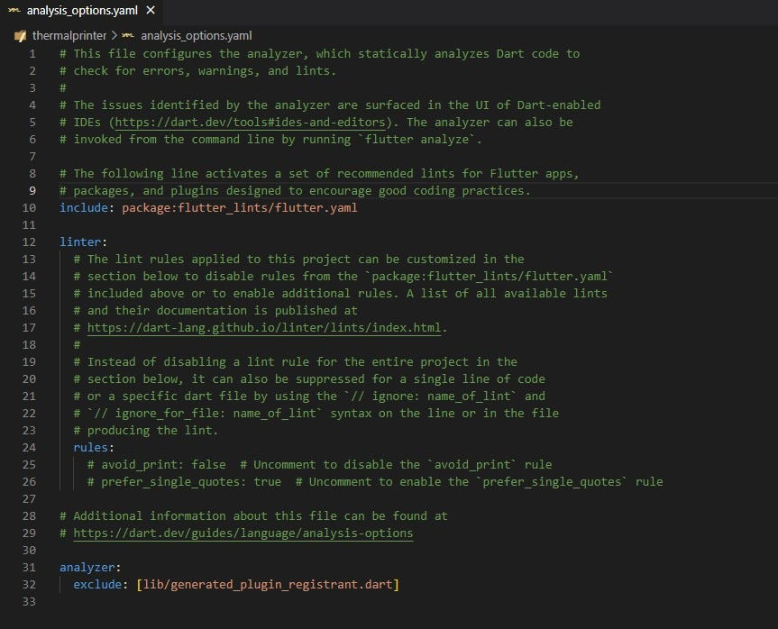

### 3.1 — O código

Exclua o diretório `sample_feature`, pois não iremos precisar.

Adicione também o pacote `permission_handler` para solicitar acesso ao bluetooth. Não esqueça do `flutter pub get`.

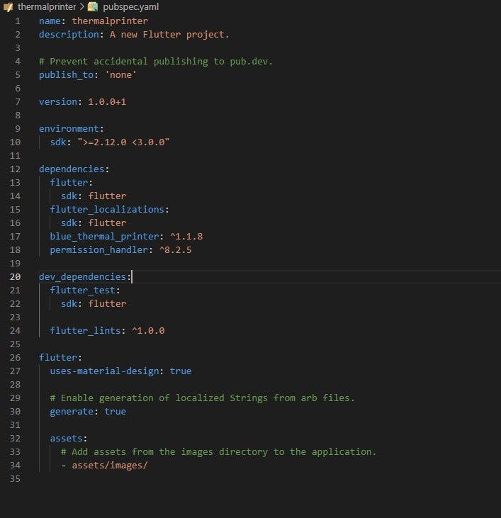

Siga as configurações que o pacote requer. Você precisa entrar na página deles e fazer a configuração para o Android. Nessa versão que estou usando, as configurações são as que apresento abaixo.

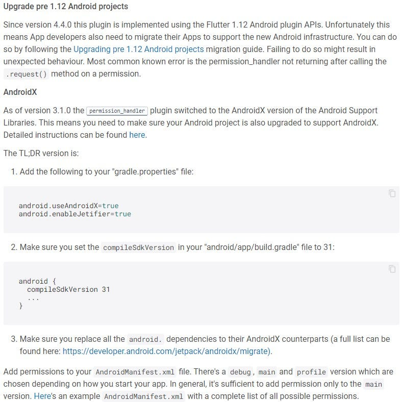

Dentro da pasta `src`, crie um arquivo chamado `widget_to_image.dart`. Crie a pasta `common` e o arquivo `utils.dart`. Crie outra pasta dentro de `/src` com o nome de `impressora` e, dentro dela, os arquivos `impressora.dart` e `visualiza_impressao.dart`.

O código completo está neste repositório: [lib/src](lib/src) (veja em especial [common](lib/src/common) e [impressora](lib/src/impressora)).

## 4 — Vamos às explicações

O seu código está pronto e agora precisamos entender os porquês.

Muito tentei imprimir apenas texto, mas essa impressora não reconhecia os caracteres especiais. Ela teimava em imprimir caracteres desconhecidos, chineses ou sei lá o quê.

Foi aí que captei uma informação: se ela consegue imprimir imagem, por que não transformar o texto em imagem e imprimir assim?

Criei o arquivo `visualiza_impressao.dart` e nele é possível ter uma prévia de como sairá a impressão nessa impressora. O container está com tamanho 190 na variável `_tamanhoContainer`, que reflete exatamente os 80mm do papel desta impressora. Você deve adaptar esse tamanho para a sua impressora.

Assim ficou fácil de programar sem gastar papel desnecessariamente. Você consegue visualizar previamente o que você vai mandar imprimir.

O método `capture` do arquivo `utils.dart` é responsável por transformar todos os widgets em imagem e logo em seguida enviamos para o método `imprimir` do arquivo `impressora.dart`. Dê uma olhada no arquivo `impressora.dart` porque você pode adaptar segundo o manual do próprio package.

**Detalhe:** para fazer a primeira impressão funcionar, é necessário parear o seu celular via bluetooth com a impressora. Para isso é só mandar buscar e, quando aparecer **MTP-3**, você solicita a conexão e pareia utilizando o código `0000`. Depois disso, vá no APP, clique em atualizar lista e ela estará lá. Aperte em conectar e a impressora ficará com a luz azul. Isso quer dizer que deu certo!

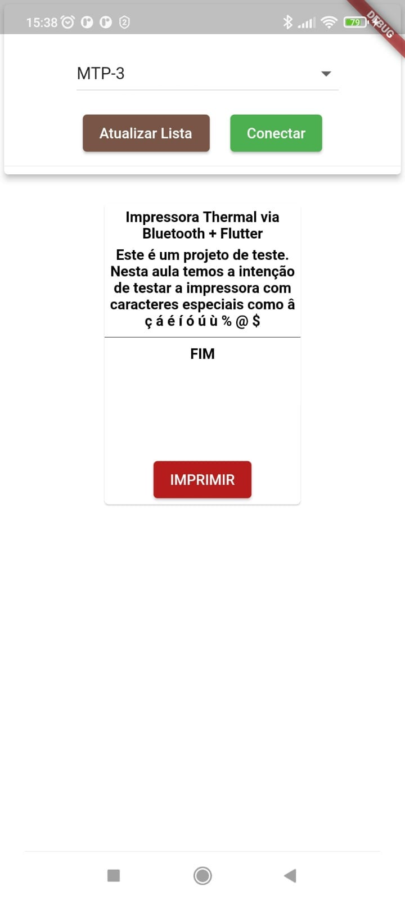

*Projeto final no celular*

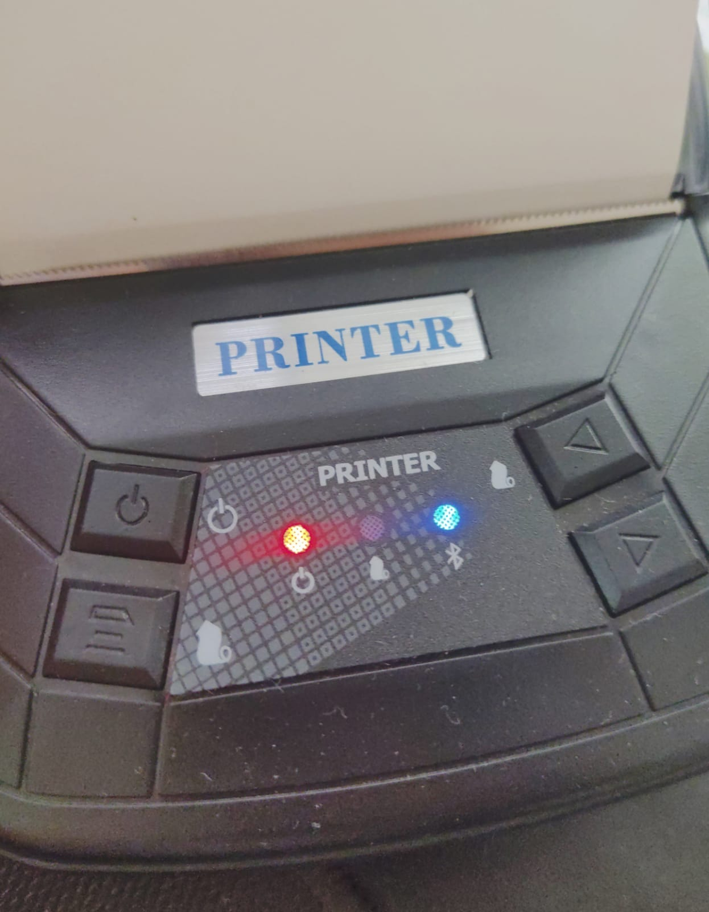

*LED azul indicando a conexão bluetooth com o celular*

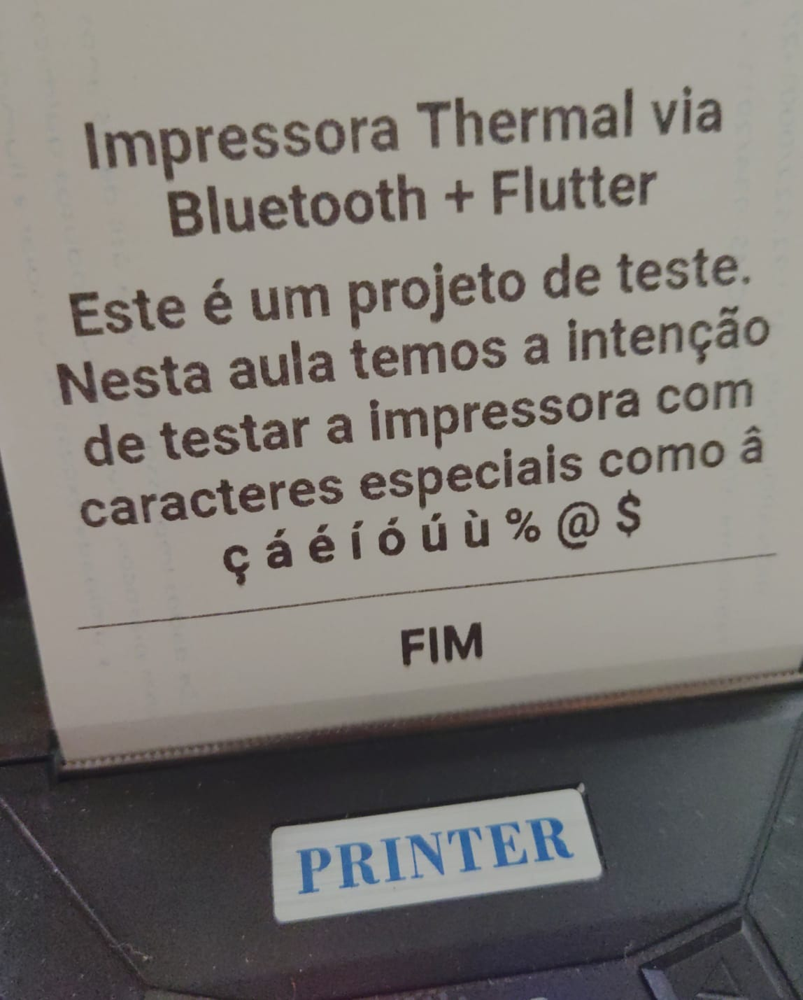

*Resultado final impresso*

### Dica de ouro

Considere deixar o fundo branco e não transparente. O branco economiza tinta e fica invisível no papel. Já o transparente sai como preto.

## Erros conhecidos

- Nas impressoras que testei, a cada reimpressão é necessário que a mesma seja reiniciada antes. Ela perde o alinhamento. Não identifiquei ainda o porquê.
- Em uma das impressoras, os caracteres ficam irreconhecíveis às vezes (viram caracteres de máquina ou oriental). Ainda não descobri também o motivo.

Eu fui criando o projeto e escrevendo esse tutorial, e ele está funcional. Faça as adaptações que precisar, mas a prova de conceito está feita!

## Contato

LinkedIn: https://www.linkedin.com/in/paulobtx/

Obrigado pela sua atenção.
